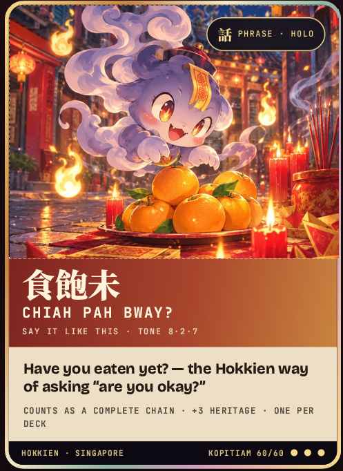

# UDE AR Holos

A browser-based AR prototype for Holo cards. Point a camera at the **“Chiah Pah Bway?”** card to see a ghost rise from the artwork, then tap **Reveal the meal** to show a 3D plate of Hainanese chicken rice. The experience runs in a web browser; visitors do not need to install an app.



## Try it locally

You need Node.js and a computer with a webcam. This project has no npm dependencies or build step.

```powershell
git clone https://github.com/Meditix1/ude-ar-holos.git
cd ude-ar-holos
node server.js
```

Open **http://localhost:8000**, allow camera access, and point the webcam at a printout or another screen showing [`assets/target_holo.png`](assets/target_holo.png). When the ghost appears, tap **Reveal the meal**.

Keep the server running while you test. Opening `index.html` directly as a `file://` URL prevents the browser from loading the tracking file and 3D model.

## How it works

The card image is preprocessed into `assets/targets.mind`. [MindAR](https://hiukim.github.io/mind-ar-js-doc/) detects that image in the camera feed and anchors the ghost and meal to it. [A-Frame](https://aframe.io/) renders the image cutout, model, and animations. The QR code you print on a card should open the hosted page; the card artwork is what keeps the AR content attached.

| File | Purpose |
| --- | --- |
| `index.html` | AR scene, interface, and interactions |
| `server.js` | Local development server only |
| `assets/target_holo.png` | Card artwork to print or display for scanning |
| `assets/targets.mind` | Compiled image-tracking target |
| `assets/ghost-cutout.png` | Transparent ghost sprite |
| `assets/hainanese_chicken_rice.glb` | 3D meal shown after a tap |

## Customize a card

1. Finish the card artwork, then compile it with the [MindAR image target compiler](https://hiukim.github.io/mind-ar-js-doc/tools/compile/). Replace `assets/targets.mind` with the downloaded file.
2. Replace the ghost sprite and/or GLB model in `assets`, and update their paths in `index.html`.
3. Adjust the AR elements' position, rotation, and scale in `index.html` to fit the artwork. Keep `targetIndex: 0` when tracking one card.
4. Test the printed card under different lighting, especially if it has reflective foil.

### Optional pronunciation audio

Record a fluent Hokkien speaker saying “Chiah pah bway?” and save it as `assets/chiah-pah-bway.mp3`. In `index.html`, change `const phraseAudioReady = false;` to `true`. The **Hear the phrase** button will then appear and play the recording when tapped.

## Host it online

Host the **repository root** as a static website, with `index.html` at the site root. No build command or running Node server is required on the host. Use HTTPS so mobile browsers can request camera access. After deploying, open the site on a phone, scan the printed card, and make a QR code for the final website URL.

## Credits

The [Hainanese Chicken Rice model by National Heritage Board](https://sketchfab.com/3d-models/hainanese-chicken-rice-6a0d0aa3851849508f584248f96cd417) is licensed under [CC BY 4.0](https://creativecommons.org/licenses/by/4.0/). The website includes a visible attribution link; keep it when publishing the prototype.
